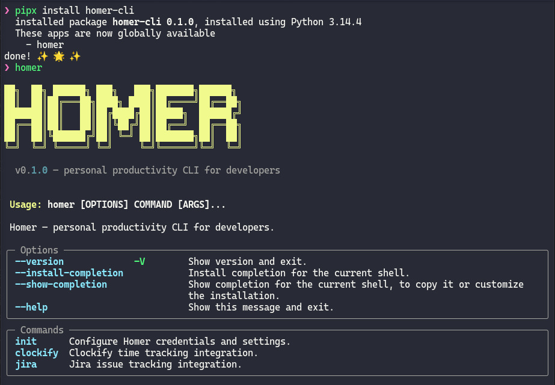

# Homer 🏠

Homer is a personal productivity CLI for developers, providing native integrations with **Jira** and **Clockify** from your terminal.

## 📚 Documentation Quick Links

**Need help navigating?** → [DOCUMENTATION.md](DOCUMENTATION.md) - Complete documentation index

**New to Homer?** Start here:
- **[GETTING_STARTED.md](GETTING_STARTED.md)** - Step-by-step setup guide for first-time users
- **[CHEATSHEET.md](CHEATSHEET.md)** - Quick command reference

**For detailed guidance:**
- **[QUICKSTART.md](QUICKSTART.md)** - 5-minute getting started guide
- **[INSTALL.md](INSTALL.md)** - Detailed installation with troubleshooting
- **[USAGE.md](USAGE.md)** - Comprehensive feature guide and workflows
- **[EXAMPLES.md](EXAMPLES.md)** - Real-world scenarios and recipes
- **[TROUBLESHOOTING.md](TROUBLESHOOTING.md)** - Common issues and solutions

## Features

### ⏱️ Clockify Time Tracking
- **Start/stop timers** with descriptions, projects, and tags
- **View current timer** with elapsed time
- **Generate reports** - summary and detailed time breakdowns by project/tag/date
- Auto-create missing projects and tags

### 🎯 Jira Issue Management  
- **List** your open issues (assigned, not Done)
- **View** issue details with description, status, priority, assignee
- **Create** new issues with project, type, description, priority
- **Comment** on issues
- **Mention** team members in comments with automatic user lookup

## Installation

### Requirements
- **Python 3.13+**
- Jira and Clockify API credentials

### Install with pipx (Recommended)

[pipx](https://pipx.pypa.io) installs Homer in an isolated environment and makes the `homer` command globally available — nothing to activate.

```bash
pipx install homer-cli
```

### Install with pip

```bash
pip install homer-cli
# or into a virtualenv:
python3 -m venv ~/.venvs/homer && source ~/.venvs/homer/bin/activate
pip install homer-cli
```

### Install from source (development)

```bash
git clone https://github.com/marcelohfonseca/homer-cli.git
cd homer
pdm install
pdm run homer --help
```

### After installation

```bash
homer --version   # confirm it's installed
homer init        # interactive credential setup
```



> See [INSTALL.md](INSTALL.md) for detailed instructions, credential gathering guide, and troubleshooting.

## Quick Start

### Clockify Timer

Start timing your current task:
```bash
homer clockify start "Fixing login bug"
```

With project and tags:
```bash
homer clockify start "Code review" --project "web-api" --tags "review,urgent"
```

Check what you're working on:
```bash
homer clockify current
```

Stop all running timers:
```bash
homer clockify stop
```

### Clockify Reports

View a summary by project:
```bash
homer clockify summary 2024-01-01 2024-01-31
```

With filters:
```bash
homer clockify summary 2024-01-01 2024-01-31 --project "web-api" --group-by DATE
```

Detailed time entries:
```bash
homer clockify detailed 2024-01-01 2024-01-31
```

### Jira Issues

List your open issues:
```bash
homer jira list
```

View issue details:
```bash
homer jira view NDI-123
```

Create a new issue:
```bash
homer jira create "Fix login bug"
```

With more options:
```bash
homer jira create "Implement auth" \
  --project WEB \
  --type Story \
  --priority High \
  --description "Add JWT authentication to API"
```

Add a comment:
```bash
homer jira comment NDI-123 "This is ready for QA"
```

Mention a team member:
```bash
homer jira mention NDI-123 "alice" "Can you review this?"
```

## Commands Reference

### Global

- `homer init` - Initialize configuration (~/.env)
- `homer --help` - Show all available commands

### Clockify

#### Timer Commands
- `homer clockify start DESCRIPTION [OPTIONS]` - Start a timer
  - `--project NAME, -p` - Project name (auto-creates if missing)
  - `--tags TAGS, -t` - Comma-separated tag list (auto-creates if missing)

- `homer clockify current` - Show currently running timer

- `homer clockify stop` - Stop all running timers

#### Report Commands
- `homer clockify summary DATE_FROM DATE_TO [OPTIONS]` - Summary report
  - Format: `YYYY-MM-DD`
  - `--project NAME, -p` - Filter by project name
  - `--tags NAME, -t` - Filter by tag name
  - `--group-by STRATEGY, -g` - Grouping: DATE, PROJECT, TAG (default: PROJECT)

- `homer clockify detailed DATE_FROM DATE_TO [OPTIONS]` - Detailed report
  - Format: `YYYY-MM-DD`
  - `--project NAME, -p` - Filter by project name
  - `--tags NAME, -t` - Filter by tag name

### Jira

#### Issue Commands
- `homer jira list` - List your open issues

- `homer jira view KEY` - View issue details
  - Example: `homer jira view NDI-123`

- `homer jira create SUMMARY [OPTIONS]` - Create a new issue
  - `--project KEY, -p` - Project key (default: NDI)
  - `--type TYPE, -t` - Issue type: Story, Bug, Task, etc. (default: Story)
  - `--description TEXT, -d` - Issue description
  - `--assignee ACCOUNT_ID, -a` - Assignee (default: you)
  - `--priority LEVEL` - Priority: Highest, High, Medium, Low, Lowest

- `homer jira comment KEY MESSAGE` - Add comment to issue
  - Example: `homer jira comment NDI-123 "This looks good"`

- `homer jira mention KEY USERNAME MESSAGE` - Mention user in comment
  - Automatically finds the user by name/email
  - Example: `homer jira mention NDI-123 "john" "Can you review?"`

## Usage Examples

### Typical Workflow

**Morning standup:**
```bash
homer jira list              # See what's assigned to you
```

**Start working on an issue:**
```bash
homer clockify start "Implementing user authentication" \
  --project "web-api" \
  --tags "backend,feature"
```

**During the day:**
```bash
homer clockify current       # Check time spent
homer clockify stop          # Stop timer before meeting
homer clockify start "Team meeting" --project "admin"
```

**Update issue status:**
```bash
homer jira view NDI-123      # Check current status
homer jira comment NDI-123 "Ready for code review"
homer jira mention NDI-123 "alice" "Please review when you get a chance"
```

**End of week report:**
```bash
# Summary by project
homer clockify summary 2024-01-29 2024-02-02 --group-by PROJECT

# Detailed breakdown
homer clockify detailed 2024-01-29 2024-02-02
```

### Advanced Examples

**Filter reports by project:**
```bash
homer clockify summary 2024-01-01 2024-01-31 --project "web-api"
```

**Group by multiple dimensions:**
```bash
homer clockify summary 2024-01-01 2024-01-31 --group-by "DATE,PROJECT"
```

**Create issue with all options:**
```bash
homer jira create "Critical bug in production" \
  --project NDI \
  --type Bug \
  --priority Highest \
  --description "Users cannot log in via LDAP. Stack trace: ..."
```

**Comment workflow:**
```bash
# First add a comment
homer jira comment NDI-456 "Implementation complete"

# Then mention specific people
homer jira mention NDI-456 "qa_team" "Ready for testing"
```

## Configuration

Homer stores configuration in `~/.env`:

```bash
JIRA_BASE_URL=https://company.atlassian.net
JIRA_USER=john@company.com
JIRA_API_TOKEN=your_api_token_here

CLOCKIFY_API_KEY=your_api_key
CLOCKIFY_WORKSPACE=workspace_id
CLOCKIFY_USER=user_id
```

To update configuration:
```bash
homer init
```

You can also edit `~/.env` directly with your preferred editor.

## Documentation

For more detailed information, see:

- **[QUICKSTART.md](QUICKSTART.md)** - 5-minute setup guide
- **[INSTALL.md](INSTALL.md)** - Detailed installation with screenshots
- **[USAGE.md](USAGE.md)** - Comprehensive feature guides and workflows
- **[EXAMPLES.md](EXAMPLES.md)** - Real-world scenarios and recipes
- **[TROUBLESHOOTING.md](TROUBLESHOOTING.md)** - Common issues and solutions

## Development

### Run Tests

```bash
pdm run pytest tests/ -v
```

### Run Linting & Type Checking

```bash
pdm run ruff check .
pdm run mypy src/
```

### Project Structure

```
homer/
├── src/homer/
│   ├── cli.py                 # Root CLI app
│   ├── config.py              # Settings & environment
│   ├── exceptions.py          # Error types
│   ├── clockify/              # Clockify integration
│   │   ├── client.py          # HTTP client
│   │   ├── service.py         # Business logic
│   │   ├── commands.py        # CLI commands
│   │   └── models.py          # Pydantic models
│   └── jira/                  # Jira integration
│       ├── client.py          # HTTP client
│       ├── service.py         # Business logic
│       ├── commands.py        # CLI commands
│       └── models.py          # Pydantic models
├── tests/                     # Comprehensive test suite
├── pyproject.toml             # Project config
└── README.md                  # This file
```

## Architecture

Homer follows a **layered architecture** with clean separation of concerns:

### Models Layer
Type-safe Pydantic models for API contracts and domain entities.

### Client Layer  
HTTP clients (using `httpx`) that handle:
- Authentication
- Request/response serialization
- Error handling
- API-specific quirks

### Service Layer
Business logic orchestration:
- Workflow coordination
- Data transformation
- Default values
- No I/O operations

### CLI Layer
Command-line interface:
- Argument parsing (Typer)
- Output formatting (Rich)
- Error to message conversion

## Contributing

1. Fork the repository
2. Create a feature branch (`git checkout -b feature/amazing-feature`)
3. Add tests for new functionality
4. Ensure all tests pass: `pdm run pytest tests/`
5. Commit changes (`git commit -m 'Add amazing feature'`)
6. Push to branch (`git push origin feature/amazing-feature`)
7. Open a Pull Request

## License

This project is licensed under the MIT License - see LICENSE file for details.

## Support

For issues, questions, or suggestions:
- Open an issue on GitHub
- Check existing documentation
- Review test files for usage examples

## Roadmap

### Phase 5+
- Jira transitions (move issues between statuses)
- Jira watchers (add/remove issue observers)
- Jira labels (add/remove issue labels)
- Custom Jira fields support
- Clockify/Jira integration (link time entries to issues)
- Terminal-based UI for interactive workflows
- Webhook support for real-time updates

---

**Made with ❤️ for developers by developers**

